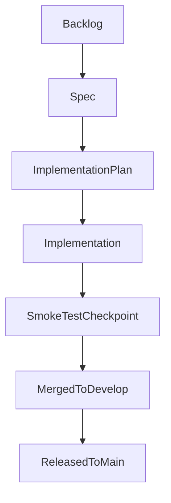

# AI-Assisted Development Workflow

This document is the canonical reference for how development moves through this repository.

The goal of this workflow is simple: AI agents should do most of the execution work, while humans focus on the parts that matter most from a human perspective: choosing direction, making decisions when the requirements are unclear, and reviewing the final result before merge or release.

The workflow is designed around a persistent execution contract. Once a run starts, it should keep advancing the work until it reaches a real stopping point: the pull request is ready for human review, a human decision is required, a dependency blocks progress, or an automated loop escalates after retry or timeout limits. Opening a branch, opening a PR, or finishing one sub-step is not enough by itself.

For substantial or multi-part mutating item work, the workflow also requires
incremental checkpoint commits after each completed logical sub-part. This gives
interrupted runs a recoverable boundary without changing review, CI, readiness,
tracker, or merge gates.

When a checkpointed worktree-isolated run is resumed, the workflow front-loads
the checkpoint decision and complete isolation context through
`checkpoint-resume-gate.sh` before any mutation. A runner may continue only from
the assigned worktree after the gate returns `continue`; pending checkpoints and
unclear isolation stop for a fresh fully isolated dispatch. Operators should not
resume a paused runner while sibling runners remain active, and isolation
verification never satisfies or waives checkpoint state.

---

## Why This Workflow Exists

Software delivery gets more reliable when each stage answers a different question:

- **Backlog**: Is this the right thing to work on now?
- **Spec**: What should be built, and how will we know it is correct?
- **Implementation plan**: How should we build it in this codebase?
- **Implementation**: Does the code, its supporting tests, and its documentation match the agreed plan?
- **Merge**: Is the change ready to join the integration branch?
- **Release**: Is the integrated work ready to ship to production?

Each piece of tracked work usually starts as a row in an issue tracker such as Linear, Jira, GitHub Issues, or ClickUp. From this point on, this document calls that tracked unit a **work item**.

Comments, review threads, automated findings, and failing checks on a pull request are a different kind of issue entirely. From this point on, this document calls that pull-request-side work **PR feedback**.

---

## The Stages And Their Value

The process moves through the stages below in order. The point of this section is not automation yet; it is to explain what each stage does and why it exists.

| Stage                   | What this stage does                                                                                                                                                                                                                                                          | Why it matters                                                                                                  |
| ----------------------- | ----------------------------------------------------------------------------------------------------------------------------------------------------------------------------------------------------------------------------------------------------------------------------- | --------------------------------------------------------------------------------------------------------------- |
| **Backlog**             | Collects candidate work items, priorities, dependencies, and deadlines.                                                                                                                                                                                                       | Keeps the team from starting work without context or priority.                                                  |
| **Spec**                | Defines the user-facing or business-facing outcome: behavior, rules, acceptance criteria, and scope.                                                                                                                                                                          | Prevents building the wrong thing or solving the wrong problem.                                                 |
| **Implementation plan** | Converts the spec into a technical approach for this repository: files, sequencing, risks, migrations, rollout details, the edge cases and test approach the implementation must cover, and any observability or analytics work needed to operate and understand the feature. | Prevents costly implementation churn and keeps design decisions explicit.                                       |
| **Implementation**      | Produces the actual code, supporting automated tests, and documentation changes.                                                                                                                                                                                              | Turns approved intent into a concrete change set while keeping developer-facing verification close to the work. |
| **Merge**               | Moves the approved change into `develop`.                                                                                                                                                                                                                                     | Creates a stable integration point for completed work.                                                          |
| **Release**             | Ships integrated work from `develop` to `main` using the release flow.                                                                                                                                                                                                        | Separates "merged" from "in production" and keeps release discipline explicit.                                  |

### Backlog

The backlog is where work starts. A work item exists here before the team commits to a solution. This stage is about priority, timing, dependencies, and clarity of the request.

Before a Backlog item enters spec writing, orchestration builds a conservative
spec-dispatch context when possible. Shared terminology with another in-scope
item is not enough to create a dependency: the workflow records relationships as
`Dependent`, `Orthogonal`, or `Unclear`, preserves human-confirmed design
decisions from tracker comments or current-session context, and stops for a
human decision when ambiguity could change product scope.

### Spec

The spec explains **what** should happen and **why** it matters. It should describe actors, workflows, business rules, acceptance criteria, scope boundaries, and any product-facing measurement requirements in product terms.

This workflow intentionally keeps the spec product-first. The spec should not lock in detailed technical design unless the product decision genuinely depends on it.

When user-behavior analytics matter, the spec should define the product intent behind them: which user actions or outcomes matter, what questions the team wants to answer, and what privacy or consent constraints apply. The implementation plan should then translate those requirements into concrete instrumentation, data pipelines, dashboards, or alerting.

### Implementation Plan

The implementation plan picks up after the spec is merged. It explains **how** the repository should satisfy the spec: which files change, what order the work should happen in, what risks exist, what data or migration steps are needed, which edge cases must be validated, what observability and analytics support the feature requires, and what smoke test runbook should prove the change works.

This stage protects the codebase from "understood in my head" engineering. It also gives future reviewers a concrete basis for deciding whether the implementation stayed on course, including whether the testing strategy covers the tricky or failure-prone cases rather than only the happy path.

When relevant, the plan should make observability and analytics explicit instead of leaving them implicit. That can include frontend crash reporting, backend logging and alerting, product analytics events, and any downstream analytical-data handling needed to make the feature measurable and supportable in production.

Plans must also record the `Cross-Cutting Operational Assumption Check`. When a
plan depends on an operational fact that concurrent work could invalidate, such
as an environment target, approved base branch, artifact owner, linked resource,
or canonical configuration value, the planner records the value, source,
verification time, bounded current-batch / related-PR scope, and result. The
parent orchestrator owns same-surface conflict resolution. Implementers
re-verify applicable sources before file edits and stop on `Stale or
conflicting` evidence instead of guessing.

### Implementation

Implementation turns the approved plan into code, tests, docs, and changelog updates. This is where the repository changes, but it is not a license to improvise on scope. If implementation reveals a missing requirement or a design gap that the plan cannot safely answer, the workflow stops and asks for a decision instead of silently inventing one.

This stage also includes the validation work needed to prove the implementation is truly ready. That means keeping automated tests in sync during development and, later, running the final smoke-test checkpoint before humans treat the change as ready.

The final implementation-validation checkpoint in this workflow is the smoke test: a targeted run driven by a smoke test runbook or an existing committed automated spec.

### Merge

Merge is the point where a change joins `develop`. A merged change is integrated, but not necessarily released. Treating merge as its own stage keeps integration quality and production release quality from getting conflated.

### Release

Release is the step where the team decides that `develop` is ready to ship. The workflow uses a dedicated release branch and a controlled PR flow so versioning, changelog curation, tagging, and backports happen deliberately.

---

## Workflow At A Glance



For the three authored artifacts in the middle of the workflow, the same review pattern repeats:

1. Draft the artifact or code on a workflow branch.
2. Run an internal review gate.
3. Resolve automated PR feedback and CI findings.
4. Hand the PR to a human only when it is actually ready.
5. Merge, then move to the next stage.

After implementation is code-review ready, the workflow can still run a smoke test as a final validation checkpoint. That checkpoint is intentionally different from the spec, plan, and implementation review loops: it produces a pass/fail validation result, not another reviewed artifact PR.

That repeated pattern is one of the main reasons the workflow scales well with AI assistance: it creates a predictable loop for authored artifacts without pretending every checkpoint has the same review semantics.

For complex workflow decision-gate documentation changes, the PR evidence must
include a consistency matrix before human-readiness is claimed. The matrix lists
the gate inputs, allowed outcomes, required next actions, mirror surfaces, and
examples when examples are part of the changed surface. Simple documentation
changes that do not alter decision-gate behavior can record a short
not-applicable rationale instead.

---

## How AI Agents Fit Into The Process

The sections above describe the process in human terms. This section explains how AI agents are layered onto that process.

At the broadest level, humans still choose what matters. A human decides which work item should start, clarifies ambiguous requirements, reviews the final PR, and decides whether to merge or release. The automation exists to compress the execution between those human touchpoints.

### Entry Modes

Humans usually enter the workflow in one of two ways:

1. **Targeted mode**: start or resume one known item.
2. **Portfolio mode**: ask the system to scan the portfolio and advance all safe eligible work.

The portfolio-wide coordinator is the **Portfolio Orchestrator** (`orchestrator`). From this point on, this document uses that name for the agent that inspects the whole portfolio, selects eligible items, groups parallel-safe work, and dispatches one item-level runner per item.

The single-item coordinator is the **Work Item Runner** (`item-orchestrator`). From this point on, this document uses that name for the agent that owns one work item, branch, development folder, or PR and keeps it moving until it reaches a real terminal condition.

Stage agents such as `product-manager`, `tech-lead`, and `developer` do not decide portfolio priority on their own. They are dispatched for a specific item by a human or by the Work Item Runner.

### Agent Layers

| Layer                       | Role in the workflow                                                                                                     |
| --------------------------- | ------------------------------------------------------------------------------------------------------------------------ |
| **Portfolio Orchestrator**  | Scans the portfolio, selects safe work, and dispatches item-level runs.                                                  |
| **Work Item Runner**        | Resolves exactly one item and drives it through the next deterministic steps without stopping early.                     |
| **Stage agent**             | Produces the stage output itself, such as a spec, plan, or implementation.                                               |
| **Internal review agent**   | Reviews the draft output against the repository's review contract before the PR is handed to external systems or humans. |
| **Automated reviewer loop** | Resolves third-party PR review findings until the PR is clean or escalated.                                              |
| **CI loop**                 | Waits for required checks to pass and handles fix cycles when they fail.                                                 |
| **Human reviewer**          | Reviews the final PR when the automated work is already clean.                                                           |

### Stage Agents

The main stage agents map to the authored stages and the final validation checkpoint:

| Stage                   | Primary agent     | Purpose                                                |
| ----------------------- | ----------------- | ------------------------------------------------------ |
| **Spec**                | `product-manager` | Produces the spec PR.                                  |
| **Implementation plan** | `tech-lead`       | Produces the plan PR.                                  |
| **Implementation**      | `developer`       | Produces the implementation PR.                        |
| **Smoke test**          | `smoke-tester`    | Executes the smoke test runbook and reports pass/fail. |
| **Post-merge QA**       | `post-merge-qa`   | QA work already on `develop` / `develop-<slug>`; may open one fix PR. |

### Internal Review And External Review

This workflow uses two kinds of review that are easy to confuse, so it is worth naming them clearly.

Review performed by repository-managed agents using local protocols such as `REVIEW.md`, `01-review-spec-protocol.md`, `02-review-implementation-plan-protocol.md`, or `03-review-implementation-protocol.md` is called **internal AI review**.

Review performed by external PR review products such as CodeRabbit, Greptile, Devin Review, or similar Git-hosted tools is called a **third-party reviewer**. These tools are useful, but they are not the same thing as the repository's internal review agents.

### The Execution Loop

For a typical spec, plan, or implementation item, the AI-assisted flow looks like this:

1. A human starts a work item directly or asks for portfolio-wide advancement.
2. The appropriate orchestrator resolves the next deterministic action.
3. A stage agent creates or updates the branch and draft PR.
4. An internal review agent drives the draft PR to a clean review state.
5. The automated reviewer loop resolves third-party PR feedback.
6. The CI loop waits for required checks to pass.
7. The PR is marked ready for human review.
8. A human reviews and either merges or requests changes.

This means the AI system is not just writing a first draft. It is responsible for most of the execution between the initial brief and the point where a human is justified in spending review time.

---

## Key Boundaries And Rules

### Spec Versus Plan

The spec defines what should happen. The implementation plan defines how this repository should make it happen. If a document needs detailed file paths, architecture sequencing, migration steps, or low-level technical trade-offs, it belongs in the implementation plan rather than the spec.

### Ready For Review Versus Still In Progress

Opening a PR does not mean a stage is done. A PR is only ready when the internal review gate is clean, configured automated reviewers are clean or intentionally skipped, CI is green, and previous human feedback has been addressed. The operational `PR Readiness` section below defines how to signal that state.

### Spec Gaps

When implementation reveals a missing requirement or unresolved choice, the workflow should stop and report the gap. The fix is to update the spec or plan and then resume, not to let an agent silently invent product or architecture decisions.

---

## Operational Reference

The sections below keep this document usable as a master reference after the narrative introduction.

### Commands By Stage

| Stage                            | Claude Code                                                       | Cursor                                                        | Codex                              | Any AI tool                                                                                                                                                                                               |
| -------------------------------- | ----------------------------------------------------------------- | ------------------------------------------------------------- | ---------------------------------- | --------------------------------------------------------------------------------------------------------------------------------------------------------------------------------------------------------- |
| Add backlog item                 | `/add-backlog-item`                                               | `/add-backlog-item`                                           | `/add-backlog-item` alias         | `docs/workflow/development-workflow/protocols/00-add-backlog-item-protocol.md`                                                                                                                            |
| Write spec                       | `product-manager` agent                                           | `/generate-new-feature`                                       | `workflow-spec-writer` skill       | `docs/workflow/development-workflow/protocols/01-generate-spec-protocol.md`                                                                                                                               |
| Write plan                       | `tech-lead` agent                                                 | `/generate-implementation-plan`                               | `workflow-plan-writer` skill       | `docs/workflow/development-workflow/protocols/02-generate-implementation-plan-protocol.md`                                                                                                                |
| Implement                        | `developer` agent                                                 | `/implement-development`                                      | `workflow-implementer` skill       | `docs/workflow/development-workflow/protocols/03-implement-development-protocol.md`                                                                                                                       |
| Review gate (spec / plan / code) | Native review against `REVIEW.md`                                 | `/review-spec`, `/review-implementation-plan`, `/review-code` | Native review against `REVIEW.md`  | `REVIEW.md` plus compatibility wrappers in `docs/workflow/development-workflow/protocols/`                                                                                                                |
| Smoke test                       | `smoke-tester` agent                                              | `/smoke-tester`                                               | —                                  | `docs/workflow/development-workflow/protocols/04-smoke-test-protocol.md`                                                                                                                                  |
| Post-merge QA                    | `post-merge-qa` agent / `/post-merge-qa` (alias `/merged-qa-tester`) | `/post-merge-qa` (alias `/merged-qa-tester`)               | `/post-merge-qa` alias (or `/merged-qa-tester`) | `docs/workflow/development-workflow/protocols/08-post-merge-qa-protocol.md`                                                                                                                               |
| Run reviewer loop                | `/run-reviewer-loop` command (or `automated-reviewer-loop` agent) | `/run-reviewer-loop`                                          | `/run-reviewer-loop` alias or `workflow-reviewer-loop` skill     | `docs/workflow/development-workflow/protocols/93-automated-reviewer-loop-protocol.md`                                                                                                                     |
| Advance one item                 | `/run-item` command (or `item-orchestrator` agent)                | `/run-item`                                                   | `/run-item` alias or `workflow-item-orchestrator` skill            | `docs/workflow/development-workflow/protocols/91-orchestrate-work-protocol.md` — `/run-item-work` is a deprecated alias; Cursor `item-orchestrator` is an internal handoff role, not the normal entrypoint |
| Execute bounded batch            | `/run-items`                                                      | `/run-items`                                                  | `/run-items` alias                                               | `docs/workflow/development-workflow/protocols/90-batch-orchestrate-work-protocol.md` — Protocol 90 `explicit_list` mode; supply two or more item targets; targets `develop` directly |
| Resolve epic scope / delegated gate (alias) | `/run-epic`                                           | `/run-epic`                                                   | `/run-epic` alias                                                | `docs/workflow/development-workflow/protocols/95-run-epic-protocol.md`                                                                                                                                    |
| Scan portfolio (read-only)       | `/run-work` command (or `orchestrator` agent)                     | `/run-work`                                                   | `/run-work` alias or `workflow-orchestrator` skill               | `docs/workflow/development-workflow/protocols/90-batch-orchestrate-work-protocol.md` — read-only scan; proposes batch options; single/epic targets redirect to `/run-item` / `/run-epic` (Protocol 96) |
| Batch merge                      | `/batch-merge`                                                    | `/batch-merge`                                                | `/batch-merge` alias or `batch-merge` skill                      | `docs/workflow/development-workflow/protocols/94-batch-merge-protocol.md`                                                                                                                                 |
| Graduate integration branch      | `/graduate-development <slug>`                                    | —                                                             | `/graduate-development` alias     | Follow `docs/workflow/development-workflow/protocols/05b-graduate-development-protocol.md`                                                                                                                |
| Prepare release                  | `/prepare-release`                                                | `/prepare-release`                                            | `/prepare-release` alias          | `docs/workflow/development-workflow/protocols/05-prepare-release-protocol.md`                                                                                                                             |
| Retrospective                    | `/retrospective` command                                          | `/retrospective`                                              | `/retrospective` alias or `workflow-retrospective` skill         | `docs/workflow/development-workflow/protocols/06-retrospective-protocol.md`                                                                                                                               |
| Meta-Retrospective               | `/retrospective` (invoke with meta scope, or run directly)        | `/retrospective` (meta scope)                                 | `/retrospective` alias or `workflow-retrospective` skill         | `docs/workflow/development-workflow/protocols/06b-meta-retrospective-protocol.md` — periodic verification of prior improvement effectiveness; recommended every 5 batches                                 |
| Feedback triage                  | —                                                                 | —                                                             | —                                  | `docs/workflow/development-workflow/protocols/07-feedback-triage-protocol.md` — periodically review GitHub Discussions in the "Feedback & Ideas" category and promote high-signal items to backlog issues |

After opening release PRs, protocol `05` treats the release-branch reviewer loop as skipped, applies `ready-for-regression` on the **PR targeting `main`**, and runs the CI loop until checks are green (or escalation) — same persistence contract as other release readiness work.

Verified access restrictions on third-party reviewer checks use a
remediation-first, human-only exceptional merge gate. See
[`guardrails-enforcement.md`](guardrails-enforcement.md) Gate 5 and
[`integrations/haystack-triage.md`](integrations/haystack-triage.md) for the
canonical evidence, authorization, pre-attempt audit, and one-shot admin merge
boundary.

Codex skills are stored in `.agents/skills/` for repo-scoped Codex discovery, with legacy canonical definitions retained in `.codex/skills/`. Install them into the local Codex environment with:

```bash
./scripts/development-workflow/install-codex-skills.sh
```

These skills are thin wrappers around the same workflow protocols used by the other tools. Command-style aliases such as `/add-backlog-item`, `/run-work`, `/run-item`, `/run-items`, `/run-item-work` (deprecated alias), `/run-epic`, `/run-reviewer-loop`, `/batch-merge`, `/post-merge-cleanup`, `/post-merge-qa` (alias `/merged-qa-tester`), `/prepare-release`, `/graduate-development`, `/retrospective`, and `/sync-template` map to the canonical workflow skills or protocols so Codex can be used with names similar to Claude Code commands. `/run-item` and `/run-epic` are the primary bounded commands (shared prelude + Protocol 91 or 95). `/run-item` prints `policyRecommendation.confirmationSummary` before mutation and records an invocation-scoped item/policy binding after explicit autonomy flags or human acceptance so the same selected policy is not re-prompted. `/run-items` is the bounded multi-item batch execute command (Protocol 90 `explicit_list` mode — two or more items). `/run-work` is the read-only portfolio scan entrypoint via `run-work-router.sh` (Protocol 96) — it proposes batch options but does not execute; single/epic targets redirect to `/run-item` / `/run-epic`. In no-target scan mode, `/run-work` separates `INFORMATIONAL - not actionable in this proposal`, `ACTIONABLE RESUME - can advance now`, `PROPOSED BATCH - your decision`, and `HELD - not included in proposed batch` records; approval or the recommended `/run-items` command applies only to proposed-batch records. `/run-item-work` remains a deprecated alias identical to `/run-item`.

### Workflow Capabilities And Fallbacks

This workflow depends on a few capabilities more than on any specific vendor or product:

- Git plus a remote pull-request workflow are required so agents can create branches, push work, and hand off reviewable PRs.
- CI is required so build, lint, and test checks can act as the automated merge gate.
- A repository CLI such as `gh` is recommended. Without one, agents can still prepare the branch locally and hand the human the information needed to open or update the PR manually.
- Automated PR reviewers are optional. Without them, the workflow proceeds from the internal review gate directly to CI and then to human review.
- An issue tracker is optional. Without one, portfolio-wide prioritization and "current brief" lookup require more direct human guidance.
- Browser automation is optional. Without it, smoke tests should be run manually from the committed smoke test runbook.

### Repository Modes

The workflow supports a documented repository-mode model for future
multi-repository coordination. See
[`repository-modes.md`](repository-modes.md) for the `single_repo`,
`workflow_hub`, and `product_repo` definitions, artifact ownership table, target
product repository selection rule, and PR ownership model. When no mode is
declared, repositories are interpreted as `single_repo` and keep the current
single-repository behavior.

In `workflow_hub` mode, orchestration scripts keep tracker, spec, and plan state
in the hub while routing implementation branch/PR inspection, reviewer loops, CI
loops, and implementation cleanup to the selected product repository. Use
`--repo <name>` with hub-mode discovery, next-action, batch-planning, and cleanup
commands when a product implementation action is involved. Reviewer and CI loops
also accept `--repo <owner/repo>` or `--product-repo <name>` for implementation
PRs outside the hub.

Product repository PR creation can use GitHub App authentication without
printing secrets. See
[`integrations/workflow-hub-github-app.md`](integrations/workflow-hub-github-app.md)
for required App permissions, local-only secret-reference fields, token helper
behavior, and dry-run examples for product PR routing.

Role-specific skeletons are inspectable under the template root:

- `template/workflow-hub/` lists hub-owned protocols, scripts, agents,
  configuration, and workflow runbooks.
- `template/product-repo-injection/` lists the minimal product repository
  integration set and explicitly excludes hub-owned tracker, spec, and plan
  artifacts unless required by later workflow guidance.

These skeletons are reference material in this iteration. Inspecting them does
not apply setup, sync files, or change runtime behavior.

### Branch Naming

| Branch type         | Pattern                      | Base branch |
| ------------------- | ---------------------------- | ----------- |
| Spec                | `spec/[slug]`                | `develop`   |
| Implementation plan | `implementation-plan/[slug]` | `develop`   |
| Feature             | `feature/[slug]`             | `develop`   |
| Refactor            | `refactor/[slug]`            | `develop`   |
| Bug or simple fix   | `fix/[slug]`                 | `develop`   |
| Hotfix              | `hotfix/[slug]`              | `main`      |
| Release             | `release/v[X.Y.Z]`           | `develop`   |
| Development integration | `develop-<slug>`         | `develop`   |

**Development integration branches** (`develop-<slug>`) are staging branches that collect all sub-item PRs for a multi-item grouped development. They are created by the orchestrator and deleted after the graduation PR merges to `develop`; graduation closeout (Protocol 05b Step 5 primary path, with merge-time automation fallback via `graduation-closeout-from-merged-pr.sh`) then reconciles delivered sub-items and the parent epic to terminal tracker state. Single-item developments do not use integration branches. See `docs/workflow/development-workflow/protocols/05b-graduate-development-protocol.md`.

Slug format:

- With an issue tracker: `[issue-id]-[short-description]`
- Without an issue tracker: `[short-description]`

### Development Artifacts

The spec and implementation plan for a development live under `docs/specs/developments/`:

```text
docs/specs/developments/
└── [YYYYMMDDHHMMSS]_[feature-slug]/
    ├── 1_[feature-slug]_specs.md
    └── 2_[feature-slug]_implementation-plan.md
```

Smoke test runbooks live under `docs/testing/`:

```text
docs/testing/[app-or-section]/[feature-slug].smoke-test.md
```

### Tracker Status Model

If an issue tracker is configured, the work item status usually maps to the workflow like this:

`Backlog -> Writing Spec -> Spec in Review -> Spec Ready -> Writing Plan -> Plan in Review -> Plan Ready -> In Development -> Development in Review -> Merged -> Released`

Refactor items skip the spec stages: `Backlog -> Writing Plan -> Plan in Review -> Plan Ready -> In Development -> Development in Review -> Merged -> Released`

Typical tracker fields worth keeping current:

- Status
- Type
- Priority
- Due date
- Dependency links
- Brief and decision history

### Prioritization And Dependencies

When multiple items could advance, use this order:

1. Due date within the next two weeks, earliest first.
2. Priority: Urgent -> High -> Normal/Medium -> Low. (`Normal` and `Medium` rank
   equally — different GitHub Projects boards use one or the other for the
   same "routine" tier; see `workflow-batch-overlap.sh`'s `PRIORITY_RANK`.)
3. Earlier-created items before newer items.

Dependencies override priority. If a work item depends on another item that is not yet `Merged` or `Released`, it should wait.

### Parallel Work

Parallel work is encouraged when it is safe:

- Different stages can usually proceed in parallel without conflict.
- Multiple implementations can proceed in parallel if they touch different areas of the codebase.
- Parallel database schema work should usually be serialized to avoid migration conflicts.

### Special Paths

#### Refactor

Refactor is the path for code restructuring or tech-debt cleanup that does not need a product spec but benefits from a planned approach.

Use it when all of the following are true:

- The change is code restructuring, tech-debt cleanup, or internal reorganization — not a new user-facing feature.
- The scope is understood well enough to write an implementation plan without a product spec.
- The work item brief (from a tracker or human) is sufficient context for the tech lead to plan the work.

Path: `refactor/[slug]` from `develop` -> write plan -> plan review gate -> implement -> code review gate -> smoke test as needed -> merge.

The development folder contains only a plan file (no spec). The tech lead uses the work item brief as input instead of an approved spec.

#### Fast Track

Fast track is the shortened path for bugs or simple changes that do not need the full spec-and-plan pipeline.

Use it only when all of the following are true:

- The scope is clear from the start.
- The change is expected to touch three files or fewer.
- No new architectural pattern is being introduced.
- No database migration is involved.
- The human brief is self-contained.
- The Fast Track blast-radius gate has no blockers. The issue title, body, recent comments, and any linked spec/plan must show no concrete multi-layer signal, an external-system result of no signal found, no primary-entity ambiguity that blocks a defensible routing decision, and either no high call-site volume for an identifiable primary entity or an explicit human override for high call-site volume. Cross-layer scope checks architectural spread; call-site volume checks propagation breadth even when a change stays within one or two layers. See the Fast Track blast-radius gate in `91-orchestrate-work-protocol.md` Step 2 for the decision rule.

Path: `fix/[slug]` from `develop` -> implement -> review gate -> smoke test as needed -> merge.

If the change turns out to be larger than expected, or if multi-layer scope signals, high call-site volume, or external-system impact are discovered during implementation, stop and expand back into the normal staged workflow instead of silently widening scope.

#### Hotfix

Hotfix is the path for critical production bugs or urgent security issues.

Path: `hotfix/[slug]` from `main` -> implement -> review gate -> smoke test as needed -> PR to `main` -> merge -> mandatory backport to `develop`.

The backport is not optional. It prevents `main` and `develop` from drifting apart.

**CHANGELOG**: Hotfix entries go in a **new versioned section** (e.g., `[1.0.1] - YYYY-MM-DD`), not under `[Unreleased]`. A hotfix is released immediately when it merges to `main`, so it does not belong in the unreleased block. Determine the next patch version from the most recent released section header, then insert the new versioned section **directly below `[Unreleased]`** (above all prior versioned sections). This ensures the auto-tagging workflow extracts the correct version via the first semver header after `[Unreleased]`.

**Branch lifecycle**: The `hotfix/[slug]` branch merges to `main` and is then deleted. The backport uses a separate `backport/hotfix/[slug]` branch created from `origin/main` (the post-merge state), targeting `develop`. The hotfix branch is **not** reused for the backport.

**Auto-tagging**: When a `hotfix/*` PR merges to `main`, `auto-tag-release.yml` extracts the version from the `CHANGELOG.md` versioned section (the entry added in Step 6 of `03-implement-development-protocol.md`), creates the corresponding tag, and opens a GitHub release. No manual tagging is required.

See `docs/workflow/development-workflow/protocols/03-implement-development-protocol.md` Path 4 for the full step-by-step hotfix procedure including the backport process.

### PR Readiness

Use the following labels consistently when label tooling is available:

| Label                    | Meaning                                                                                                                               |
| ------------------------ | ------------------------------------------------------------------------------------------------------------------------------------- |
| `ready-for-human-review` | Internal review is clean, configured automated reviewers are clean or skipped, CI is green, and the PR is ready for a human reviewer. |
| `needs-fixes`            | CI is failing, blocking automated feedback exists, or human-requested changes are still unresolved.                                   |

When the selected policy grants merge authority (`merge_granted`), a
`ready-for-human-review` PR is not terminal; the runner continues through the
delegated merge gate, repository merge path, cleanup, and tracker verification.
When merge authority is absent (`merge_denied`), readiness is the terminal
human handoff and the runner reports `ready_human_merge` without merging.

Opening a PR is not a terminal condition. A workflow run should continue until the PR is ready for a human checkpoint or the process escalates.

### Workflow Configuration

Repository-specific workflow integrations are declared in `.ai-dev-workflow.yaml` at the repo root.
Machine-local overrides belong in `.ai-dev-workflow.local.yaml`, which is
gitignored. Local review overrides replace the matching shared reviewer list
for this checkout, including `review.on_draft.runner`,
`review.on_draft.github`, and `review.on_ready.github`. Start from
`.ai-dev-workflow.local.example.yaml` when a workflow hub needs checkout roots,
product-repo local paths, secret references, or local tool overrides.

The file is versioned and intentionally declarative. It is the right place to record which workflow providers this repository uses for:

- Repository mode and stable product-repository identity
- Automated PR review (`codex-github` is the default ready-phase reviewer;
  CodeRabbit remains available as an explicit opt-in reviewer)
- Issue tracking
- Git hosting / pull-request workflow
- Browser automation for smoke tests or similar validation

Current schema:

```yaml
schema_version: 2

# Optional. Missing mode resolves as single_repo.
mode: single_repo

review:
  on_draft:
    runner:
      - codex
    github:
      - pr-agent
  on_ready:
    github:
      - codex-github

issue_tracker:
  provider: linear

vcs:
  provider: github

browser_automation:
  provider: playwright_mcp

template:
  is_template: true
  repository: ""
  last_synced_version: ""

# Optional. Omit to keep today's conservative behavior (mode: manual).
# Enforced at runtime by Protocols 90, 91, and 95. See guardrails-enforcement.md.
guardrails:
  mode: manual
  backlog_start:
    allow_without_confirmation: false
  stages:
    spec:
      may_open_pr: true
      may_merge_pr: false
      max_merge_risk: low
    plan:
      may_open_pr: true
      may_merge_pr: false
      max_merge_risk: low
    implementation:
      may_open_pr: true
      may_merge_pr: false
      max_merge_risk: low
      required_evidence:
        - regression
  stop_conditions:
    - unclear_requirements
    - architecture_decision
    - failing_ci
    - unresolved_blocking_review
    - high_risk_change
    - destructive_action
    - missing_tracker_context
    - missing_required_secret_or_permission
  audit:
    pr_disposition_record: required
    work_item_ledger_record: required
```

Important implementation notes:

- Repository mode fields are `mode`, `workflow_hub.product_repos[]`, and `product_repo.workflow_hub`. Shared product repository entries may contain stable non-secret identity and metadata such as `name`, `github_repo` or `git_url`, `default_branch`, `role`, `scope`, `tracker` hints, and non-secret app identifiers. Local checkout paths, private key paths, secret values, and machine-specific tool settings belong only in `.ai-dev-workflow.local.yaml`. See [`repository-modes.md`](repository-modes.md) and [`integrations/workflow-hub-github-app.md`](integrations/workflow-hub-github-app.md) for examples and validation commands.
- Product-repository-aware orchestration scripts emit ownership fields such as
  `WORKFLOW_MODE`, `ACTION_REPOSITORY_KIND`, `ACTION_REPOSITORY`, and
  `ACTION_GITHUB_REPO` so orchestrators can distinguish hub-owned planning work
  from product-owned implementation work.
- `sync-manifest.yaml` includes enforced `mode_scope` metadata: `shared`,
  `hub_only`, and `product_repo_injection`. Sync-template resolves repository
  mode before comparison: `single_repo` keeps the compatibility file set,
  `workflow_hub` selects shared and hub-only entries, and `product_repo`
  selects shared and product-repo-injection entries while reporting skipped
  scopes.
- Workflow-hub adopters can follow the setup and operations guides:
  [`workflow-hub-setup.md`](workflow-hub-setup.md),
  [`product-repo-injection.md`](product-repo-injection.md), and
  [`cross-repo-pr-flow.md`](cross-repo-pr-flow.md).
- `review.on_draft.runner` is consumed by the Step 7a internal review gate protocol (`91-orchestrate-work-protocol.md`). If omitted, the gate falls back to running the stage-appropriate `claude` reviewer once. Developers can override the list locally via `.ai-dev-workflow.local.yaml` (gitignored).
- `review.on_draft.github` and `review.on_ready.github` are consumed by `scripts/development-workflow/pr-review-loop.sh` for external automated PR review (Step 7). If the config file is absent, or both lists are omitted or empty, automated PR review is treated as not configured and the review loop reports `skipped`. See the Workflow Configuration section for the default ready-phase reviewer and CodeRabbit opt-in policy.
- Legacy `review.internal_reviewers`, `review.platforms`, and `review.phase_after_clean` keys remain accepted for one transition release and map to the new lifecycle buckets.
- `template.is_template` when set to `true` marks this repository as a framework template. Protocol 02 Step 0 (Template-Fit Check) becomes mandatory: before writing any implementation plan, the tech lead must verify that the spec is sufficiently generic for all downstream consumers. Set to `true` in the template repository itself; omit or leave `false` in downstream consumer repositories.
- `template.repository` is an optional `owner/repo` reference to the upstream template repository. When set, the retrospective protocol (Step 3b) cross-references each finding against that repository's issue tracker to classify findings as already tracked, already fixed, or a new upstream contribution candidate. Leave empty or omit to skip this step entirely. Note: this field is set by downstream consumer repos pointing back to their template origin; the template repo itself leaves this empty.
- `template.last_synced_version` is written automatically by the sync-template skill after a successful sync (e.g., `v0.22.0`). The retrospective uses this value to identify closed template issues whose fix landed in a version newer than the downstream's last sync, surfacing "just sync" opportunities.
- `guardrails` is an optional top-level section that declares how much authority AI agents have when advancing work through the development workflow. When the section is absent, all guardrails values resolve to safe defaults that preserve today's conservative, human-reviewed behavior (agents do not merge pull requests and do not start backlog work without confirmation). The default mode is `manual`. See [`guardrails.md`](guardrails.md) for the full reference, worked examples, and migration note. See [`guardrails-enforcement.md`](guardrails-enforcement.md) for the runtime enforcement reference (three-layer precedence, six enforcement gates, named stop conditions).

Provider-specific setup still lives in the integration guides under `docs/workflow/development-workflow/integrations/`.

### Automated Review And CI

When an automated PR review platform is configured, the Work Item Runner should keep operating after each push instead of stopping at "PR opened".

The expected sequence is:

1. Run the stage-appropriate internal review gate.
2. Run the automated reviewer loop until blocking PR feedback is resolved or the process escalates.
3. Run the CI loop until required checks are green or the process escalates.
4. Mark the PR ready for human review only after both loops are clean.

GitHub review platforms are declared in `.ai-dev-workflow.yaml` under
`review.on_draft.github` and `review.on_ready.github`, with matching
`.ai-dev-workflow.local.yaml` lists taking precedence for local tool/subscription
differences. The repository helpers that support this loop are:

- `scripts/development-workflow/pr-review-loop.sh`
- `scripts/development-workflow/pr-ci-loop.sh`

### Release Summary

Release is triggered by a human when `develop` is ready to ship.

Summary:

1. Create `release/v[X.Y.Z]` from `develop`.
2. Assemble pending `changelog.d/` fragments into `CHANGELOG.md`, curate the versioned release section, and bump any versioned manifests.
3. Open two PRs from the release branch: one to `main`, one back to `develop`.
4. Merge the `main` PR first so the release tag is created, then merge the backport PR.

Versioning follows Semantic Versioning:

- `PATCH`: backwards-compatible fixes
- `MINOR`: backwards-compatible features or improvements
- `MAJOR`: breaking changes

---

## Protocol And Integration Index

Use these documents when you need the detailed rules behind a part of the workflow:

### Protocol Numbering

Protocol prefixes are stable family identifiers, not a promise of contiguous numbering.

- `01`-`06` are the current primary stage families in workflow order.
- `00` is reserved for pre-stage backlog intake (creating tracker work items before spec work).
- Generate and review protocols for the same stage share the same family number.
- `90`-`99` are orchestration, readiness, and other cross-cutting operational protocols.
- The numbering was normalized after an older stage was removed, so the current primary stages are contiguous again.

### Design Assets

- `docs/workflow/development-workflow/design-assets.md` — capture, storage
  (`<dev-folder>/assets/`), discovery order, and lightweight plan/smoke fidelity
  hooks for graphical design references (not a visual-regression platform)

### Core Protocols

- `docs/workflow/development-workflow/protocols/00-add-backlog-item-protocol.md`
- `docs/workflow/development-workflow/protocols/01-generate-spec-protocol.md`
- `docs/workflow/development-workflow/protocols/01-review-spec-protocol.md`
- `docs/workflow/development-workflow/protocols/02-generate-implementation-plan-protocol.md`
- `docs/workflow/development-workflow/protocols/02-review-implementation-plan-protocol.md`
- `docs/workflow/development-workflow/protocols/03-implement-development-protocol.md`
- `docs/workflow/development-workflow/protocols/03-review-implementation-protocol.md`
- `docs/workflow/development-workflow/protocols/04-smoke-test-protocol.md`
- `docs/workflow/development-workflow/protocols/05-prepare-release-protocol.md`
- `docs/workflow/development-workflow/protocols/06-retrospective-protocol.md`
- `docs/workflow/development-workflow/protocols/90-batch-orchestrate-work-protocol.md`
- `docs/workflow/development-workflow/protocols/91-orchestrate-work-protocol.md`
- `docs/workflow/development-workflow/protocols/92-pr-readiness-signal-protocol.md`
- `docs/workflow/development-workflow/protocols/93-automated-reviewer-loop-protocol.md`
- `docs/workflow/development-workflow/protocols/94-batch-merge-protocol.md`

### Review Contract

- `REVIEW.md`

### Tooling And Configuration

- `docs/workflow/development-workflow/agent-model-config.md`
- `docs/workflow/development-workflow/guardrails.md` — plain-language reference for the guardrails configuration model: autonomy modes, per-stage permissions, risk scale, stop conditions, audit requirements, safe defaults, and worked examples
- `docs/workflow/development-workflow/guardrails-enforcement.md` — single source of truth for how orchestration resolves effective guardrails (three-layer precedence), the config-field→run-epic-policy mapping table, the six enforcement gates (load+report, backlog-start, PR-open, delegated review, delegated merge, completion), named stop conditions and the stop-message contract, conservative defaults, and audit-evidence rules
- `.ai-dev-workflow.yaml` - repo-level workflow integration manifest (`mode`, `workflow_hub.product_repos[]`, `product_repo.workflow_hub`, `review.on_draft.runner`, `review.on_draft.github`, `review.on_ready.github`, `template.is_template`, `template.repository`, `template.last_synced_version`, `issue_tracker.provider`, `vcs.provider`, `browser_automation.provider`, `guardrails`)
- `.ai-dev-workflow.local.example.yaml` - placeholder-only example for gitignored local checkout, secret-reference, review-runner, and tool overrides

Repository helpers:

- `scripts/development-workflow/validate-workflow-config.sh`
- `scripts/development-workflow/add-backlog-item.sh`
- `scripts/development-workflow/discover-workflow-state.sh`
- `scripts/development-workflow/workflow-batch-plan.sh`
- `scripts/development-workflow/workflow-next-action.sh`
- `scripts/development-workflow/pr-review-loop.sh`
- `scripts/development-workflow/pr-ci-loop.sh`
- `scripts/development-workflow/batch-merge.sh`

### Integration Guides

- `docs/workflow/development-workflow/integrations/issue-tracker.md`
- `docs/workflow/development-workflow/integrations/linear.md`
- `docs/workflow/development-workflow/integrations/pr-review-platform.md`
- `docs/workflow/development-workflow/integrations/bugbot.md`
- `docs/workflow/development-workflow/integrations/greptile.md`
- `docs/workflow/development-workflow/integrations/devin.md`
- `docs/workflow/development-workflow/integrations/coderabbit.md`
- `docs/workflow/development-workflow/integrations/haystack.md`
- `docs/workflow/development-workflow/integrations/llm-router.md`
- `docs/workflow/development-workflow/integrations/github-projects.md`
- `docs/workflow/development-workflow/integrations/workflow-hub-github-app.md`
- `docs/workflow/development-workflow/integrations/ci-cd-deployment.md`
- `docs/workflow/development-workflow/integrations/e2e-regression.md`
- `docs/workflow/development-workflow/integrations/actions-cost-audit.md`

---

## Final Reminder

This workflow is intentionally opinionated.

Humans should choose direction, resolve ambiguity, review high-quality PRs, and decide when to merge or release. Agents should draft, revise, fix, test, and keep advancing the work until it reaches a real human checkpoint.
